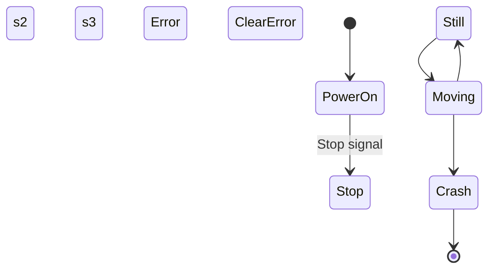

```mermaid
stateDiagram-v2
%% https://mermaid.ai/open-source/syntax/stateDiagram.html 
%% definiowanie stanóœ
    s0 : PowerOn
    s1: Stop
    s2: 
    s3: 


    s100: Error
    s101: ClearError
%% opis relacji
    [*] --> s0
    s0 --> s1: Stop signal
    Still --> Moving
    Moving --> Still %% another comment
    Moving --> Crash
    Crash --> [*]
```
