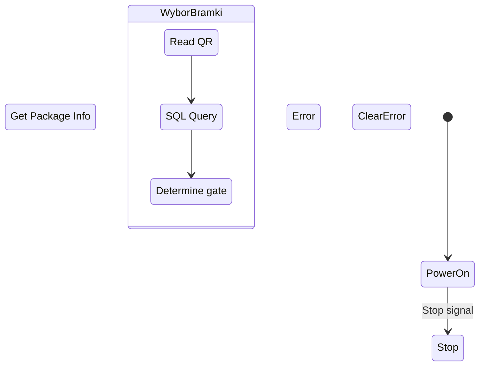

```mermaid
stateDiagram-v2
%% https://mermaid.ai/open-source/syntax/stateDiagram.html 
%% definiowanie stanóœ
    s0 : PowerOn
    s1: Stop
    s2: Get Package Info
    s3: Read QR
    s4: SQL Query
    s5: Determine gate
    
    

    s100: Error
    s101: ClearError
%% opis relacji
    [*] --> s0
    s0 --> s1: Stop signal
    
    state WyborBramki{
        s3 --> s4
        s4 --> s5
    } 
```
