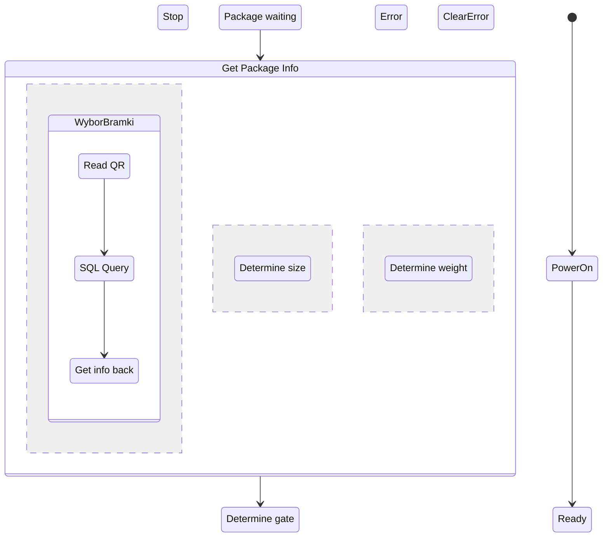

```mermaid
stateDiagram-v2
%% https://mermaid.ai/open-source/syntax/stateDiagram.html 
%% definiowanie stanóœ
    PowerOn
    Stop
    Ready
    s1: Package waiting
    s2: Get Package Info
    s3: Read QR
    s4: SQL Query
    s5: Get info back
    s6: Determine gate
    s7: Determine size
    s8: Determine weight
    

    s100: Error
    s101: ClearError
%% opis relacji
    [*] --> PowerOn
    PowerOn --> Ready
    s1 --> s2
    state s2 {
        WyborBramki
        --
        s7
        --
        s8      
    }
    s2 --> s6
    
    state WyborBramki{
        s3 --> s4
        s4 --> s5
    } 
```
